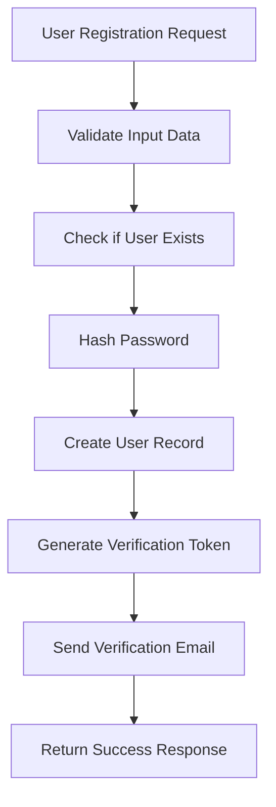

# Authentication Flow Reference

## Complete Authentication Implementation Guide

### User Registration Flow



### Implementation Example

#### Registration Controller
```javascript
const bcrypt = require('bcrypt');
const jwt = require('jsonwebtoken');
const crypto = require('crypto');

class AuthController {
  async register(req, res) {
    try {
      // 1. Validate input
      const { email, password, username } = req.body;

      if (!email || !password || !username) {
        return res.status(400).json({
          error: { code: 'MISSING_FIELDS', message: 'Missing required fields' }
        });
      }

      // 2. Check if user already exists
      const existingUser = await User.findOne({ email });
      if (existingUser) {
        return res.status(409).json({
          error: { code: 'USER_EXISTS', message: 'User already exists' }
        });
      }

      // 3. Hash password
      const saltRounds = 12;
      const hashedPassword = await bcrypt.hash(password, saltRounds);

      // 4. Create user
      const user = await User.create({
        email,
        password: hashedPassword,
        username,
        emailVerified: false
      });

      // 5. Generate verification token
      const verificationToken = crypto.randomBytes(32).toString('hex');
      await EmailVerification.create({
        userId: user.id,
        token: verificationToken,
        expiresAt: new Date(Date.now() + 24 * 60 * 60 * 1000) // 24 hours
      });

      // 6. Send verification email
      await sendVerificationEmail(user.email, verificationToken);

      // 7. Return success
      res.status(201).json({
        success: true,
        message: 'User registered successfully. Please check your email to verify your account.'
      });
    } catch (error) {
      console.error('Registration error:', error);
      res.status(500).json({
        error: { code: 'REGISTRATION_ERROR', message: 'Registration failed' }
      });
    }
  }

  async login(req, res) {
    try {
      const { email, password } = req.body;

      // 1. Find user
      const user = await User.findOne({ email });
      if (!user) {
        return res.status(401).json({
          error: { code: 'INVALID_CREDENTIALS', message: 'Invalid credentials' }
        });
      }

      // 2. Verify password
      const isValidPassword = await bcrypt.compare(password, user.password);
      if (!isValidPassword) {
        return res.status(401).json({
          error: { code: 'INVALID_CREDENTIALS', message: 'Invalid credentials' }
        });
      }

      // 3. Check email verification
      if (!user.emailVerified) {
        return res.status(401).json({
          error: { code: 'EMAIL_NOT_VERIFIED', message: 'Please verify your email address' }
        });
      }

      // 4. Generate JWT tokens
      const accessToken = jwt.sign(
        { userId: user.id, email: user.email },
        process.env.JWT_SECRET,
        { expiresIn: '1h' }
      );

      const refreshToken = jwt.sign(
        { userId: user.id },
        process.env.JWT_REFRESH_SECRET,
        { expiresIn: '7d' }
      );

      // 5. Store refresh token
      await RefreshToken.create({
        userId: user.id,
        token: refreshToken,
        expiresAt: new Date(Date.now() + 7 * 24 * 60 * 60 * 1000)
      });

      // 6. Update last login
      await User.updateOne(
        { _id: user.id },
        { lastLoginAt: new Date() }
      );

      res.json({
        success: true,
        data: {
          user: {
            id: user.id,
            email: user.email,
            username: user.username
          },
          tokens: {
            accessToken,
            refreshToken
          }
        }
      });
    } catch (error) {
      console.error('Login error:', error);
      res.status(500).json({
        error: { code: 'LOGIN_ERROR', message: 'Login failed' }
      });
    }
  }

  async refreshToken(req, res) {
    try {
      const { refreshToken } = req.body;

      if (!refreshToken) {
        return res.status(401).json({
          error: { code: 'NO_REFRESH_TOKEN', message: 'Refresh token required' }
        });
      }

      // 1. Verify refresh token
      let decoded;
      try {
        decoded = jwt.verify(refreshToken, process.env.JWT_REFRESH_SECRET);
      } catch (error) {
        return res.status(401).json({
          error: { code: 'INVALID_REFRESH_TOKEN', message: 'Invalid refresh token' }
        });
      }

      // 2. Check if refresh token exists in database
      const tokenRecord = await RefreshToken.findOne({
        userId: decoded.userId,
        token: refreshToken,
        expiresAt: { $gt: new Date() }
      });

      if (!tokenRecord) {
        return res.status(401).json({
          error: { code: 'REFRESH_TOKEN_INVALID', message: 'Refresh token invalid or expired' }
        });
      }

      // 3. Generate new tokens
      const user = await User.findById(decoded.userId);
      if (!user) {
        return res.status(401).json({
          error: { code: 'USER_NOT_FOUND', message: 'User not found' }
        });
      }

      const newAccessToken = jwt.sign(
        { userId: user.id, email: user.email },
        process.env.JWT_SECRET,
        { expiresIn: '1h' }
      );

      const newRefreshToken = jwt.sign(
        { userId: user.id },
        process.env.JWT_REFRESH_SECRET,
        { expiresIn: '7d' }
      );

      // 4. Update refresh token in database
      await RefreshToken.updateOne(
        { _id: tokenRecord._id },
        {
          token: newRefreshToken,
          expiresAt: new Date(Date.now() + 7 * 24 * 60 * 60 * 1000)
        }
      );

      res.json({
        success: true,
        data: {
          tokens: {
            accessToken: newAccessToken,
            refreshToken: newRefreshToken
          }
        }
      });
    } catch (error) {
      console.error('Refresh token error:', error);
      res.status(500).json({
        error: { code: 'REFRESH_ERROR', message: 'Token refresh failed' }
      });
    }
  }
}
```

### OAuth Integration

#### Google OAuth Strategy
```javascript
const passport = require('passport');
const GoogleStrategy = require('passport-google-oauth20').Strategy;

passport.use(new GoogleStrategy({
  clientID: process.env.GOOGLE_CLIENT_ID,
  clientSecret: process.env.GOOGLE_CLIENT_SECRET,
  callbackURL: "/auth/google/callback"
}, async (accessToken, refreshToken, profile, done) => {
  try {
    // Find or create user
    let user = await User.findOne({ googleId: profile.id });

    if (user) {
      // Update existing user
      user.googleAccessToken = accessToken;
      user.lastLoginAt = new Date();
      await user.save();
    } else {
      // Create new user
      user = await User.create({
        googleId: profile.id,
        email: profile.emails[0].value,
        username: profile.displayName,
        firstName: profile.name.givenName,
        lastName: profile.name.familyName,
        avatar: profile.photos[0].value,
        emailVerified: true,
        googleAccessToken: accessToken
      });
    }

    return done(null, user);
  } catch (error) {
    return done(error, null);
  }
}));

// OAuth routes
app.get('/auth/google',
  passport.authenticate('google', { scope: ['profile', 'email'] }));

app.get('/auth/google/callback',
  passport.authenticate('google', { failureRedirect: '/login' }),
  (req, res) => {
    // Successful authentication, generate JWT tokens
    const token = jwt.sign(
      { userId: req.user.id, email: req.user.email },
      process.env.JWT_SECRET,
      { expiresIn: '1h' }
    );

    res.redirect(`/dashboard?token=${token}`);
  });
```

### Session Management

#### Session Middleware
```javascript
const session = require('express-session');
const MongoStore = require('connect-mongo');

app.use(session({
  secret: process.env.SESSION_SECRET,
  resave: false,
  saveUninitialized: false,
  store: MongoStore.create({
    mongoUrl: process.env.MONGODB_URI,
    collectionName: 'sessions',
    touchAfter: 24 * 3600 // Lazy session update
  }),
  cookie: {
    secure: process.env.NODE_ENV === 'production', // HTTPS only in production
    httpOnly: true, // Prevent XSS
    maxAge: 24 * 60 * 60 * 1000 // 24 hours
  }
}));
```

### Security Headers and Protections

#### Security Middleware
```javascript
const helmet = require('helmet');
const rateLimit = require('express-rate-limit');
const csurf = require('csurf');

// Security headers
app.use(helmet({
  contentSecurityPolicy: {
    directives: {
      defaultSrc: ["'self'"],
      styleSrc: ["'self'", "'unsafe-inline'"],
      scriptSrc: ["'self'"],
      imgSrc: ["'self'", "data:", "https:"],
    },
  },
}));

// Rate limiting
const limiter = rateLimit({
  windowMs: 15 * 60 * 1000, // 15 minutes
  max: 100, // Limit each IP to 100 requests per windowMs
  message: {
    error: {
      code: 'RATE_LIMIT_EXCEEDED',
      message: 'Too many requests from this IP'
    }
  }
});
app.use('/api/', limiter);

// CSRF protection
app.use(csurf({ cookie: true }));
app.use((req, res, next) => {
  res.locals.csrfToken = req.csrfToken();
  next();
});
```

### Password Reset Flow

```javascript
const crypto = require('crypto');

class PasswordResetController {
  async requestReset(req, res) {
    try {
      const { email } = req.body;

      const user = await User.findOne({ email });
      if (!user) {
        // Don't reveal if user exists to prevent enumeration
        return res.json({
          success: true,
          message: 'If an account exists with this email, a reset link has been sent.'
        });
      }

      // Generate reset token
      const resetToken = crypto.randomBytes(32).toString('hex');
      const resetTokenExpiry = new Date(Date.now() + 1 * 60 * 60 * 1000); // 1 hour

      await PasswordReset.create({
        userId: user.id,
        token: resetToken,
        expiresAt: resetTokenExpiry
      });

      // Send reset email
      await sendPasswordResetEmail(user.email, resetToken);

      res.json({
        success: true,
        message: 'If an account exists with this email, a reset link has been sent.'
      });
    } catch (error) {
      console.error('Password reset request error:', error);
      res.status(500).json({
        error: { code: 'RESET_REQUEST_ERROR', message: 'Request failed' }
      });
    }
  }

  async resetPassword(req, res) {
    try {
      const { token, newPassword } = req.body;

      // Find valid reset token
      const resetRequest = await PasswordReset.findOne({
        token,
        expiresAt: { $gt: new Date() }
      }).populate('userId');

      if (!resetRequest) {
        return res.status(400).json({
          error: { code: 'INVALID_RESET_TOKEN', message: 'Invalid or expired token' }
        });
      }

      // Validate new password
      if (newPassword.length < 8) {
        return res.status(400).json({
          error: { code: 'WEAK_PASSWORD', message: 'Password must be at least 8 characters' }
        });
      }

      // Hash new password
      const hashedPassword = await bcrypt.hash(newPassword, 12);

      // Update user password
      await User.findByIdAndUpdate(resetRequest.userId._id, {
        password: hashedPassword
      });

      // Invalidate all user sessions
      await Session.deleteMany({ userId: resetRequest.userId._id });

      // Delete reset token
      await PasswordReset.deleteOne({ _id: resetRequest._id });

      res.json({
        success: true,
        message: 'Password has been reset successfully'
      });
    } catch (error) {
      console.error('Password reset error:', error);
      res.status(500).json({
        error: { code: 'RESET_ERROR', message: 'Password reset failed' }
      });
    }
  }
}
```

### Two-Factor Authentication (2FA)

```javascript
const speakeasy = require('speakeasy');
const QRCode = require('qrcode');

class TwoFactorController {
  async setup2FA(req, res) {
    try {
      const user = await User.findById(req.user.id);

      if (user.twoFactorEnabled) {
        return res.status(400).json({
          error: { code: '2FA_ALREADY_ENABLED', message: 'Two-factor authentication already enabled' }
        });
      }

      // Generate secret
      const secret = speakeasy.generateSecret({
        name: `ChatKit App (${user.email})`,
        issuer: 'ChatKit'
      });

      // Store secret temporarily
      await User.findByIdAndUpdate(req.user.id, {
        twoFactorSecret: secret.base32
      });

      // Generate QR code
      const qrCodeUrl = await QRCode.toDataURL(secret.otpauth_url);

      res.json({
        success: true,
        data: {
          secret: secret.base32,
          qrCode: qrCodeUrl
        }
      });
    } catch (error) {
      console.error('2FA setup error:', error);
      res.status(500).json({
        error: { code: '2FA_SETUP_ERROR', message: '2FA setup failed' }
      });
    }
  }

  async verify2FA(req, res) {
    try {
      const { token } = req.body;
      const user = await User.findById(req.user.id);

      if (!user.twoFactorSecret) {
        return res.status(400).json({
          error: { code: '2FA_NOT_SETUP', message: '2FA not properly set up' }
        });
      }

      // Verify token
      const verified = speakeasy.totp.verify({
        secret: user.twoFactorSecret,
        encoding: 'base32',
        token: token,
        window: 2
      });

      if (!verified) {
        return res.status(400).json({
          error: { code: 'INVALID_2FA_TOKEN', message: 'Invalid 2FA token' }
        });
      }

      // Enable 2FA
      await User.findByIdAndUpdate(req.user.id, {
        twoFactorEnabled: true
      });

      res.json({
        success: true,
        message: 'Two-factor authentication enabled successfully'
      });
    } catch (error) {
      console.error('2FA verify error:', error);
      res.status(500).json({
        error: { code: '2FA_VERIFY_ERROR', message: '2FA verification failed' }
      });
    }
  }

  async authenticateWith2FA(req, res, next) {
    // Middleware to handle 2FA during login
    const { twoFactorToken } = req.body;
    const userId = req.authUserId; // Set by previous auth middleware

    const user = await User.findById(userId);

    if (user.twoFactorEnabled) {
      if (!twoFactorToken) {
        return res.status(401).json({
          error: { code: '2FA_REQUIRED', message: 'Two-factor authentication token required' }
        });
      }

      const verified = speakeasy.totp.verify({
        secret: user.twoFactorSecret,
        encoding: 'base32',
        token: twoFactorToken,
        window: 2
      });

      if (!verified) {
        return res.status(401).json({
          error: { code: 'INVALID_2FA_TOKEN', message: 'Invalid 2FA token' }
        });
      }
    }

    next();
  }
}
```